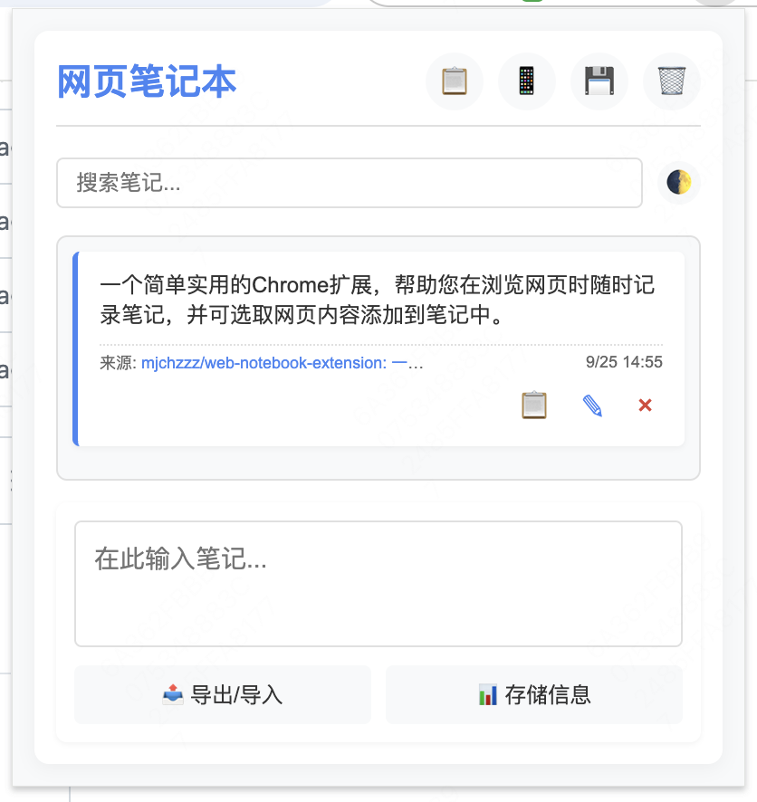

# 网页笔记本 Chrome 扩展

一个简单实用的Chrome扩展，帮助您在浏览网页时随时记录笔记，并可选取网页内容添加到笔记中。



## 功能特点

- ✏️ **快速记录笔记**：随时记录想法和重要信息
- 📋 **网页内容提取**：一键获取网页中选中的文本
- 🔍 **搜索功能**：快速查找历史笔记
- 📱 **二维码生成**：将当前网页URL转换为二维码，方便在移动设备上打开
- 📄 **分页浏览**：整洁地浏览所有笔记
- 🌓 **深色/浅色主题**：根据个人喜好或环境切换主题
- 📤 **数据导入/导出**：备份和恢复您的笔记数据
- 🔄 **拖拽排序**：通过拖放重新排列笔记顺序

## 安装方法

### 下载安装（开发版）

1. 从[Releases页面](https://github.com/mjchzzz/web-notebook-extension/releases)下载最新版本的`web-notebook-extension.zip`
2. 解压下载的ZIP文件
3. 在Chrome浏览器中访问 `chrome://extensions/`
4. 开启右上角的"开发者模式"
5. 点击"加载已解压的扩展程序"
6. 选择解压后的文件夹

## 使用说明

### 基本操作

- **添加笔记**：在文本框中输入内容，点击保存按钮
- **获取选中内容**：在网页中选中文本，点击扩展中的"📋"按钮
- **编辑笔记**：点击笔记内容或编辑按钮
- **删除笔记**：点击笔记右上角的"×"按钮
- **生成二维码**：点击"📱"按钮，生成当前页面的二维码

### 高级功能

- **搜索笔记**：在搜索框中输入关键词
- **切换主题**：点击"🌓"按钮在深色和浅色主题之间切换
- **导出数据**：点击"📤 导出/导入"按钮，然后复制显示的JSON数据
- **导入数据**：点击"📤 导出/导入"按钮，粘贴之前导出的JSON数据，然后点击"导入数据"
- **查看存储信息**：点击"📊 存储信息"按钮

## 隐私说明

- 所有笔记数据仅存储在您的浏览器中，使用Chrome的同步存储功能
- 扩展不会将任何数据发送到外部服务器
- 扩展仅请求必要的权限：存储、活动标签页和上下文菜单

## 开发信息

### 技术栈

- JavaScript
- Chrome Extension API
- HTML/CSS

### 项目结构

```
├── dist/                 # 构建输出目录
├── images/               # 图标和图片资源
├── background.js         # 后台脚本
├── content.js            # 内容脚本
├── manifest.json         # 扩展清单文件
├── popup.html            # 弹出窗口HTML
├── popup.js              # 弹出窗口脚本
├── qrcode.min.js         # 二维码生成库
└── package_extension.sh  # 打包脚本
```

### 构建项目

```bash
# 打包扩展
./package_extension.sh
```

## 贡献指南

欢迎提交问题报告和功能请求！如果您想贡献代码：

1. Fork 这个仓库
2. 创建您的特性分支 (`git checkout -b feature/amazing-feature`)
3. 提交您的更改 (`git commit -m 'Add some amazing feature'`)
4. 推送到分支 (`git push origin feature/amazing-feature`)
5. 开启一个 Pull Request

## 许可证

本项目采用 MIT 许可证 - 详情请参阅 [LICENSE](LICENSE) 文件

## 联系方式

如有问题或建议，请通过[GitHub Issues](https://github.com/mjchzzz/web-notebook-extension/issues)联系我。

---

希望这个扩展能帮助您更高效地记录和管理网页浏览中的重要信息！

